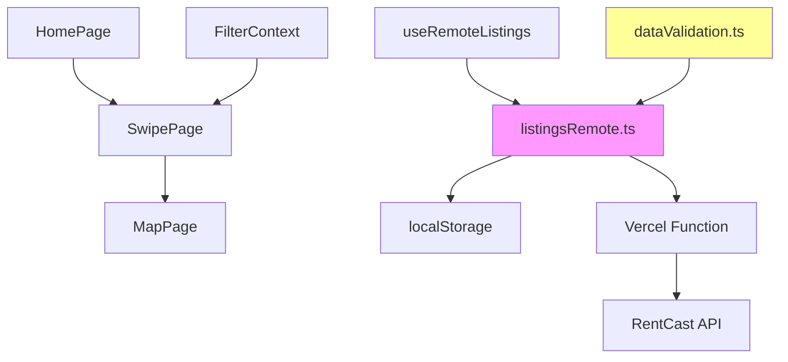

# SwipeHouse

Tinder-style NYC apartment shortlisting: swipe to decide, map to compare.

- Real listings via RentCast (quota-limited: 50 req/month)
- Stale-while-revalidate cache (24hr fresh, 7d stale max)
- Data validation (NYC bbox + price bounds + dedupe)
- Deterministic scoring (budget + must-have features)
- localStorage persistence (no accounts, no backend DB)

Repo: https://github.com/Soulemane12/home-swipe-map

## 10-second demo path
1) Home → set budget + features → Start Swiping
2) Swipe 10 listings → Like a few
3) Map → click a pin → shortlist + compare top picks

---

## 1. Problem

Apartment hunters drown in hundreds of listings and end up with 30 tabs and no shortlist. SwipeHouse turns browsing into forced yes/no decisions and automatically builds a shortlist you can explore on a map.

## 2. Constraints

- **API quota**: 50 requests/month (RentCast free tier)
- **Data quality**: Missing coordinates, outlier prices, duplicates in API responses
- **No user accounts**: localStorage-only persistence
- **Variable latency**: API response times vary
- **Design goal**: feel instant on repeat visits even with 50 req/month

## 3. Solution

**Swipe interface + stale-while-revalidate caching + deterministic scoring**

Four components:
1. Swipe UI forces binary decisions (like/pass) instead of endless browsing
2. Aggressive caching (24hr TTL) serves stale data immediately, refreshes in background
3. Data validation pipeline filters suspect listings before rendering
4. Deterministic scoring ranks by budget distance and feature match

## 4. Features (implemented)

- Home: preference setup → Start Swiping
- Swipe deck: drag + buttons, like/pass feedback, progress counter, auto-save likes
- Shortlist: filters + sorting applied locally (no refetch)
- Compare modal: top picks side-by-side (price/beds/baths, sqft when available, features)
- Map: price-labeled markers, saved/selected styling, marker/list sync, mobile sheet + desktop panel
- Persistence: liked/saved/passed + last filters stored in localStorage
- Commute: geocode + Mapbox Directions Matrix per mode (driving/bike/walk; transit currently uses driving as best available matrix profile), cached per address+listing set

## 5. Architecture

**Data flow:**
1. User sets filters → FilterContext updates
2. useRemoteListings debounces (400ms) → aborts previous request
3. listingsRemote checks cache → returns immediately if valid
4. If stale, serves cached + triggers background refresh
5. dataValidation filters suspect listings
6. Swipe deck renders, user makes decisions
7. Liked listings persist to localStorage

### Component Breakdown

**Frontend**
- [HomePage.tsx](src/pages/HomePage.tsx) - Filter inputs
- [SwipePage.tsx](src/pages/SwipePage.tsx) - Swipe deck with gesture controls
- [MapPage.tsx](src/pages/MapPage.tsx) - Mapbox visualization
- [FilterContext.tsx](src/context/FilterContext.tsx) - Global filter state

**Caching ([listingsRemote.ts](src/lib/listingsRemote.ts))**
- 24hr fresh TTL, 7-day stale max
- Background refresh via CustomEvent
- Stable cache keys (sorted filter params)

**Validation ([dataValidation.ts](src/lib/dataValidation.ts))**
- NYC bounding box: 40.4-41.0°N, -74.3 to -73.6°W
- Price bounds: rent $500-$25k, buy $50k-$50M
- Deduplication: lat/lng (5 decimals) + price + address hash
- Quality tiers: high/medium/low/suspect

**Backend ([api/rentcast.js](api/rentcast.js))**
- Vercel serverless function (hides API key)
- Parameter normalization: \`price="2200-5200"\` → \`priceMin\`/\`priceMax\`
- Allowlisted params only (prevents injection)

### Key Technologies

- **React + TypeScript** - Type safety, component model
- **Framer Motion** - Gesture-based swipe mechanics
- **Mapbox GL JS** - Interactive map rendering
- **localStorage** - Client-side cache, no server needed
- **Vite** - Fast dev server, optimized builds

## Key code pointers
- SWR cache + quota protection: [listingsRemote.ts](src/lib/listingsRemote.ts)
- Remote fetch orchestration: [useRemoteListings.ts](src/hooks/useRemoteListings.ts)
- Data validation + dedupe: [dataValidation.ts](src/lib/dataValidation.ts)
- Swipe mechanics: [SwipeDeck.tsx](src/components/listing/SwipeDeck.tsx)
- Map + marker sync: [MapPanel.tsx](src/components/map/MapPanel.tsx)
- Serverless proxy: [api/rentcast.js](api/rentcast.js)

## 6. Quick Evaluation

### Prerequisites
- Node.js 18+
- npm

### Setup

\`\`\`bash
git clone https://github.com/Soulemane12/home-swipe-map.git
cd home-swipe-map
npm install
npm run dev
\`\`\`

**Environment**: Set \`RENTCAST_API_KEY\` in \`.env.local\` or Vercel environment variables.

### What You'll See

1. **Home (http://localhost:5173)** - Filter form
2. **Swipe (/swipe)** - Cards with gesture controls (drag or arrow keys)
3. **Map (/map)** - Mapbox showing liked listings

### Cache Behavior Test

| Test | Expected |
|------|----------|
| First visit | Loading → API call → listings |
| Refresh page | Instant from cache |
| Wait 30min, refresh | Instant + background refresh icon |
| Change filters | 400ms debounce → API call |
| Clear localStorage | Next visit fetches fresh |

### Verification

\`\`\`bash
npm run typecheck  # TypeScript validation
npm run lint       # ESLint
npm run build      # Production build
\`\`\`

## 7. Data Quality Pipeline

**Validation steps:**
1. Coordinate check: reject listings outside NYC bbox
2. Price sanity: reject impossible prices (< $500 rent, > $50M buy)
3. Deduplication: lat/lng (5 decimals) + price + address hash
4. Quality scoring: assign tier based on missing fields

**Quality tiers:**
- \`high\`: Valid coords + price in range + photo + address
- \`medium\`: Minor issues (missing sqft, price near bounds)
- \`low\`: Multiple missing fields but usable
- \`suspect\`: Invalid coords or impossible price → **filtered out**

## 8. Caching & Request Budgeting

**Invariants:**
- UI never blocks on refresh; cached data always renders first
- Every request is abortable + deduped via stable cache key

**Remote vs Local filters (quota-safe)**

Remote-affecting (triggers fetch after 400ms debounce):
- mode (rent/buy)
- geo anchor (NYC only; validation bbox enforced)
- pagination (limit/offset)
- Remote fetch is intentionally minimal (mode + geo + limit/offset); all other refinement happens locally to protect quota.

Local-only (never triggers fetch):
- budget range
- beds/baths
- feature toggles (pets/laundry/elevator/no-walkup)
- sorting (uses cached fields only)

**Cache key normalization:**
\`\`\`typescript
function stableKey(filters: RemoteFilters): string {
  const sorted = Object.keys(filters).sort()
    .reduce((acc, key) => ({ ...acc, [key]: filters[key] }), {});
  return JSON.stringify(sorted);
}
\`\`\`

**Why**: \`{mode:"rent", price:"2000"}\` and \`{price:"2000", mode:"rent"}\` must hit same cache entry.

**Request deduplication:**
\`\`\`typescript
const abortController = new AbortController();
fetch(url, { signal: abortController.signal });
// If user changes filters: abortController.abort();
\`\`\`

**Eviction policy:**
\`\`\`typescript
if (Object.keys(cache).length > 50) {
  const oldest = Object.entries(cache).sort((a,b) => a[1].t - b[1].t)[0][0];
  delete cache[oldest];
}
\`\`\`

## 9. Deterministic Scoring

**Formula:**
\`\`\`typescript
matchScore = 60 + budgetBonus + featureBonus - qualityPenalty
\`\`\`

| Component | Range | Calculation |
|-----------|-------|-------------|
| Base | 60 | Starting score |
| budgetBonus | 0-15 | Closer to budget midpoint = higher |
| featureBonus | 0-12 | +3 per matching must-have (pets, laundry, elevator, no-walkup) |
| qualityPenalty | 0-7 | 0/3/7 for high/medium/low; suspect is filtered out |

**Budget distance:**
\`\`\`typescript
const budgetMid = (filters.budgetMin + filters.budgetMax) / 2;
const distance = Math.abs(listing.price - budgetMid);
const budgetBonus = Math.round((1 - distance/(budgetRange/2)) * 15);
\`\`\`

**Feature matching:**
\`\`\`typescript
let featureBonus = 0;
if (filters.petsAllowed && listing.features.pets) featureBonus += 3;
// ... repeat for laundry, elevator, no-walkup
\`\`\`

**Quality penalty:**
\`\`\`typescript
const qualityPenalty = { high: 0, medium: 3, low: 7 };
// suspect listings are filtered out before scoring
\`\`\`

## 10. Security

**API key protection:**
- API key is never shipped to the browser (requests go through a serverless proxy)
- Frontend calls \`/api/listings\`, serverless function forwards to RentCast

**Parameter allowlisting:**
\`\`\`javascript
const paramMap = { city: 'city', state: 'state', /* ... */ };
for (const [k, v] of Object.entries(req.query)) {
  if (paramMap[k]) u.searchParams.set(paramMap[k], String(v));
}
\`\`\`

**Why**: Prevents injection. User can't send \`apiKey\` or arbitrary params.

**Input validation:**
- Price ranges: validate positive integers
- Coordinates: reject outside NYC bbox
- Mode: only "rent" or "buy"

## 11. Failure Modes

| Failure | Detection | Recovery |
|---------|-----------|----------|
| API down (5xx) | HTTP status | Serve expired cache if available, show warning |
| Rate limited (429) | HTTP status | Serve stale cache + "updating..." |
| Invalid coords | Outside NYC bbox | Filter out listing |
| Impossible price | <$500 or >$25k | Mark as suspect, filter out |
| Duplicate | Same lat/lng/price | Dedupe in transform |
| localStorage full | Quota error | Evict oldest cache entry |

## 12. Hackathon Scope

**Implemented:**
- ✅ Swipe interface with gesture controls
- ✅ RentCast API integration
- ✅ Stale-while-revalidate caching (24hr/7day TTLs)
- ✅ Data validation pipeline
- ✅ Deterministic scoring
- ✅ Mapbox visualization
- ✅ Responsive design
- ✅ Vercel serverless deployment

=

**Why this proves the concept:**
1. Swipe UI reduces decision fatigue
2. Caching works under rate limits
3. Data validation catches bad listings
4. Deterministic ranking (no ML needed)
5. Deployed and functional with real API

---

**Built by Soulemane Sow** | [GitHub](https://github.com/Soulemane12)
